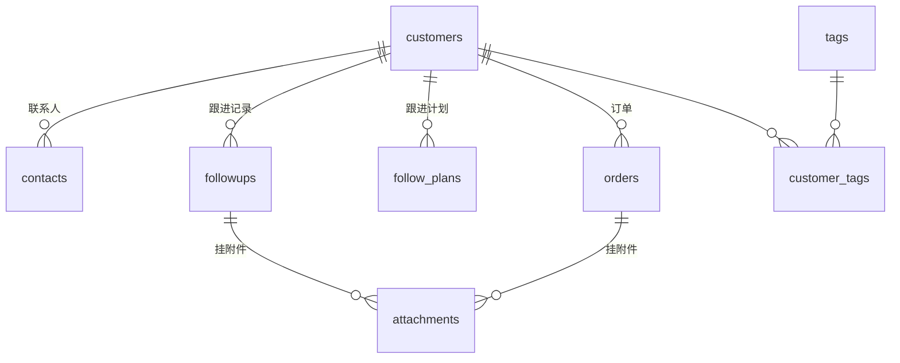

# 阶段 1 开发计划　数据层

创建于 2026-08-04　　依据 [PRD.md](../PRD.md) 第 5 节与第 8 节阶段 1、[TECH_STACK.md](../TECH_STACK.md) 第 5、6 节

## 1. 本期目标

把 PRD 第 5 节描述的业务实体落成八张 drift 表，配齐 DAO 与迁移机制，用单元测试
把约束钉住。

本期不碰界面。四个 Tab 仍是阶段 0 的占位页，不接数据。判断本期是否做完，唯一
依据是 `flutter test` 全绿加六项验收标准，不看屏幕。

这么切分的理由：数据模型改起来最贵。表结构一旦被界面代码引用，再改就要牵动多处
加迁移脚本。趁没有界面依赖时把字段和关系定死，是最省事的顺序。

## 2. 数据模型设计

### 2.1 八张表与关系



`customer_tags` 是客户与标签的多对多关联表。`attachments` 用两个可空外键分别
指向跟进记录与订单，同一时刻只有一个有值。

### 2.2 字段定义

以下为最终字段清单。所有表都有 `id`（自增主键）、`createdAt`、`updatedAt`
（UTC 毫秒时间戳）。

**customers　客户**

| 字段 | 类型 | 约束 | 说明 |
|---|---|---|---|
| name | text | 非空，长度 1-50 | 唯一必填项 |
| company | text | 可空 | |
| phone | text | 可空 | 建索引，支持模糊搜索 |
| wechat | text | 可空 | |
| address | text | 可空 | |
| source | text | 可空 | 来源渠道，自由文本 |
| note | text | 可空 | |
| stage | text | 非空，默认 `potential` | 枚举，见 2.3 |
| grade | text | 非空，默认 `c` | 枚举 A/B/C |
| lastFollowAt | int | 可空 | 最后一次跟进时间，冗余字段 |

`lastFollowAt` 是刻意的冗余。「久未联系」查询（PRD 5.6）需要按最后跟进时间过滤，
若每次都对 followups 做聚合，500 客户下会明显变慢。由 DAO 在写入跟进记录时同步
维护，代价是多一次更新。

**contacts　联系人**

| 字段 | 类型 | 约束 |
|---|---|---|
| customerId | int | 外键 → customers，级联删除 |
| name | text | 非空 |
| position | text | 可空 |
| phone | text | 可空 |
| isDecisionMaker | bool | 非空，默认 false |

**followups　跟进记录**

| 字段 | 类型 | 约束 |
|---|---|---|
| customerId | int | 外键 → customers，级联删除 |
| occurredAt | int | 非空，发生时间 |
| method | text | 非空，枚举 phone/wechat/meeting/other |
| content | text | 非空，沟通内容 |
| conclusion | text | 可空，本次结论 |

**follow_plans　跟进计划**

| 字段 | 类型 | 约束 |
|---|---|---|
| customerId | int | 外键 → customers，级联删除 |
| title | text | 非空，事项标题 |
| planAt | int | 非空，计划时间，建索引 |
| status | text | 非空，默认 `pending` |
| notifiedAt | int | 可空，实际提醒触发时间 |
| completedAt | int | 可空 |

`notifiedAt` 对应 PRD 5.3 的「记录每次提醒的实际触发时间，供可靠性自查」。
阶段 2 在一加 13 上连续验证 3 天时，靠它比对计划时间与实际触发时间的偏差。

**orders　订单**

| 字段 | 类型 | 约束 |
|---|---|---|
| customerId | int | 外键 → customers，级联删除 |
| orderNo | text | 非空，唯一索引 |
| orderedAt | int | 非空，下单日期 |
| amountCents | int | 非空，金额，单位分 |
| description | text | 可空 |
| status | text | 非空，默认 `pending` |

金额用 `amountCents` 而非 `amount`，字段名直接带单位。这是 TECH_STACK 第 6 节的
硬约定，命名上让人无法误用。

**tags　标签**

| 字段 | 类型 | 约束 |
|---|---|---|
| name | text | 非空，唯一索引 |

**customer_tags　客户标签关联**

| 字段 | 类型 | 约束 |
|---|---|---|
| customerId | int | 外键 → customers，级联删除 |
| tagId | int | 外键 → tags，级联删除 |

联合唯一索引 `(customerId, tagId)`，防重复关联。

**attachments　附件**

| 字段 | 类型 | 约束 |
|---|---|---|
| followupId | int | 可空，外键 → followups，级联删除 |
| orderId | int | 可空，外键 → orders，级联删除 |
| relativePath | text | 非空，相对应用目录的路径 |
| originalName | text | 非空，原始文件名 |
| mimeType | text | 非空 |
| sizeBytes | int | 非空 |

**只存相对路径**，绝对路径在应用重装或系统迁移后会全部失效（PRD 5.5）。
拼接由 `AttachmentPath` 统一负责，见 2.4。

加一条 CHECK 约束保证归属明确：`followupId` 与 `orderId` 必须恰好一个非空。

### 2.3 枚举

存字符串不存整数，这样导出的 JSON 能直接看懂（TECH_STACK 第 6 节）。

```dart
CustomerStage : potential | contacted | intent | deal | lost
CustomerGrade : a | b | c
FollowMethod  : phone | wechat | meeting | other
PlanStatus    : pending | notified | completed | overdue
OrderStatus   : pending | shipped | paid | completed | cancelled
```

每个枚举提供 `fromDb` / `toDb` 转换，遇到未知值抛异常而非静默降级。数据库里出现
非法枚举值意味着有 bug，静默处理只会让问题更晚暴露。

### 2.4 附件路径解析

验收第 6 项要求「路径拼接函数在应用目录变化后仍能正确解析」，所以路径拼接必须
是纯函数，不能内嵌 `getApplicationDocumentsDirectory()` 调用。

```dart
// 存：attachments/2026/08/uuid.jpg
// 取：<当前应用目录>/attachments/2026/08/uuid.jpg
String resolve(String appDir, String relativePath)
```

按年月分子目录，避免单目录堆积上千文件。测试传两个不同的 `appDir` 验证同一条
记录都能正确解析。

### 2.5 排序策略

验收第 4 项的「按紧急度排序」需要明确定义。排序键：

1. 有逾期计划的客户最前，按逾期天数降序
2. 有今日计划的客户次之
3. 有未来计划的客户，按计划时间升序
4. 无计划的客户最后，按分级 A > B > C，同级按最后跟进时间升序

这个排序要在 500 客户 + 5000 跟进记录下低于 200ms，因此不在 Dart 层做，
而是写成单条 SQL 让 SQLite 完成，靠 `follow_plans(planAt)` 与
`follow_plans(customerId, status)` 两个索引支撑。

## 3. 待办清单

### 3.1 表定义

`lib/data/tables/` 下按实体分文件，八张表八个文件。枚举放
`lib/models/enums.dart`。

drift 的外键级联需要两处配合：表定义里写 `references(..., onDelete: KeyAction.cascade)`，
同时数据库打开时执行 `PRAGMA foreign_keys = ON`。**SQLite 默认不开外键约束**，
漏了第二步级联删除会静默失效，而测试如果只测单表增删改查是发现不了的。

### 3.2 数据库主类

`lib/data/database.dart`：

- `schemaVersion = 1`
- `MigrationStrategy`：`onCreate` 建表建索引，`onUpgrade` 本期为空但结构留好
- `beforeOpen` 执行 `PRAGMA foreign_keys = ON`
- 提供内存数据库构造入口供测试用，避免测试碰真实文件

### 3.3 DAO

`lib/data/daos/` 下六个 DAO：customer / contact / followup / plan / order /
attachment。标签的读写归入 customer DAO，因为标签只在客户上下文里用。

每个 DAO 提供基础增删改查，另加业务查询：

- `CustomerDao.listByUrgency()`　按 2.5 的排序策略
- `CustomerDao.search(keyword)`　名称与电话模糊匹配
- `CustomerDao.listStale(days)`　久未联系，PRD 5.6
- `CustomerDao.countByStage()`　漏斗各阶段计数，PRD 5.6
- `FollowupDao.insertAndTouchCustomer()`　写记录并同步 `lastFollowAt`，同一事务
- `PlanDao.listDue()` / `markCompleted()` / `postpone()`　阶段 2 的提醒要用
- `OrderDao.sumAmountByCustomer()`　累计成交金额，PRD 5.4

### 3.4 测试

`test/data/` 下按验收标准组织：

| 文件 | 对应验收 |
|---|---|
| `crud_test.dart` | 第 2 项，八张表增删改查 |
| `cascade_test.dart` | 第 3 项，级联删除 |
| `migration_test.dart` | 第 5 项，v1 空库初始化 |
| `attachment_path_test.dart` | 第 6 项，路径解析 |
| `performance_test.dart` | 第 4 项，500 客户排序耗时 |
| `enum_test.dart` | 枚举往返转换与非法值抛异常 |

性能测试用内存数据库。内存库比真机文件库快，所以 200ms 这个阈值在内存库上应当
留出余量，实测若接近阈值就要警惕。这一点在验收报告里要如实写明。

## 4. 不在本期范围

- 任何界面与 riverpod provider（阶段 3）
- 提醒调度与通知（阶段 2，但 `PlanDao` 与 `notifiedAt` 字段本期就位）
- 附件的实际文件读写与压缩（阶段 4，本期只做路径解析与表记录）
- 备份导出导入（阶段 5）
- 数据库加密（不做，PRD 第 3 节已排除）

## 5. 验收标准

来自 PRD.md 阶段 1，共 6 项。实现完成后逐条回归，全部通过才进入阶段 2。

1. 八张表建表成功，外键约束生效
2. 单元测试覆盖每张表的增删改查，全部通过
3. 单元测试验证级联删除：删除客户后其联系人、跟进记录、跟进计划、订单、附件记录一并删除
4. 写入 500 客户 + 5000 跟进记录的性能测试，按紧急度排序查询耗时低于 200ms
5. 数据库版本号与迁移函数已就位，能从 v1 空库正常初始化
6. 附件表仅存相对路径，单元测试验证路径拼接函数在应用目录变化后仍能正确解析

补充自查项，不属于 PRD 但本期应当满足：

7. `flutter analyze` 无问题，`build_runner` 生成无警告
8. 金额字段为整数分，时间字段为 UTC 毫秒，枚举存字符串
9. 所有数据库访问经 DAO，无处直接拼裸 SQL 字符串（业务查询用 drift 的
   `customSelect` 时要用参数绑定，不做字符串插值）

## 6. 风险与预案

**drift_dev 2.34.0 与文档版本有差异**　阶段 0 因依赖冲突把 drift_dev 停在
2.34.0，而官网文档对应 2.34.5。若生成代码报错与文档不符，以本地
`~/.pub-cache/hosted/pub.flutter-io.cn/drift_dev-2.34.0/` 的实际实现为准。

**外键约束静默失效**　最容易踩的坑。`cascade_test.dart` 必须真的断言子表记录数
归零，不能只断言删除操作没抛异常。

**性能测试不稳定**　首次运行含 JIT 预热，耗时可能虚高。做法是预热一次再测，
并连测三轮取中位数，避免单次抖动导致验收结论反复。

**500 客户构造数据慢**　逐条插入会很慢，用 drift 的 `batch` 批量插入。若构造
耗时超过测试超时，调整 `timeout` 而非降低数据量，数据量是验收标准的一部分。
